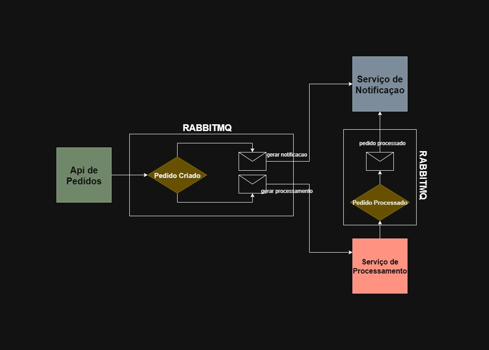

# 🛒 Order Processing System

Este projeto simula o processamento de pedidos utilizando arquitetura baseada em **microserviços**.  
Ele é dividido em três módulos principais:  

1. **API de Pedidos** → responsável por receber pedidos dos clientes.  
2. **Serviço de Mensagens** → faz o envio de mensagens via email.  
3. **Serviço de Processamento** → consome as mensagens e processa os pedidos.  

---

## 🚀 Tecnologias utilizadas

  
  
  
  
  
  
  

---

## 📂 Arquitetura do Projeto

A arquitetura do sistema pode ser representada no diagrama abaixo:

<p align="center">
  
</p>

---

## ⚙️ Funcionalidades
- ✅ Receber pedidos via API REST.  
- ✅ Enviar eventos de novos pedidos para o **RabbitMQ**.  
- ✅ Enviar mensagem de pedido em processamento.  
- ✅ Processar pedidos de forma assíncrona.  
- ✅ Armazenar dados em **PostgreSQL**.  
- ✅ Enviar mensagem de pedido processado.  
- ✅ Documentar endpoints com **Swagger**.  
- ✅ Deploy facilitado com **Docker**.  
 
---

## 🛠️ Como rodar o projeto

### 🔹 Pré-requisitos
- [Java 21](https://adoptium.net/)  
- [Maven](https://maven.apache.org/)  
- [Docker](https://www.docker.com/)  

### 🔹 Passo 1 – Clonar o repositório
```bash
git clone https://github.com/angelo7890/order-microservices.git
cd order-microservices
```

### 🔹 Passo 2 – Subir infraestrutura com Docker
```bash
docker compose up -d
```

👉 Isso irá iniciar:  
- RabbitMQ (porta `5672` / painel em `http://localhost:15672`)  
- PostgreSQL (porta `5432`)  

### 🔹 Passo 3 – Rodar os módulos
Cada módulo pode ser iniciado individualmente:  

```bash
# Dentro de order-api
./mvnw spring-boot:run

# Dentro de message-service
./mvnw spring-boot:run

# Dentro de processing-service
./mvnw spring-boot:run
```

---

## 📖 Documentação da API
A documentação Swagger estará disponível em:  

👉 `http://localhost:8080/api-docs.html`  

---

## 👨‍💻 Autor
**Angelo Rodrigues**    
📎 [GitHub](https://github.com/angelo7890)  
